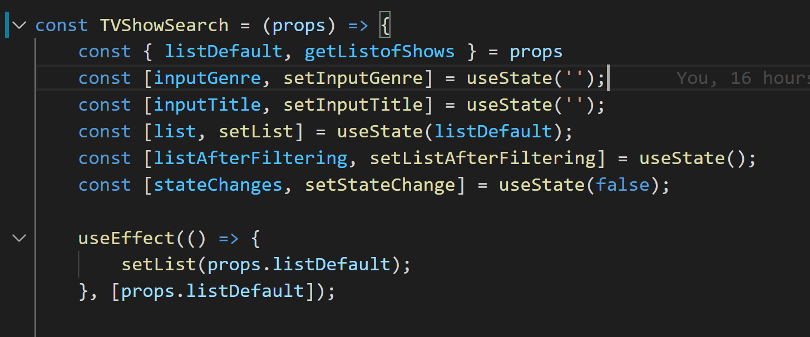
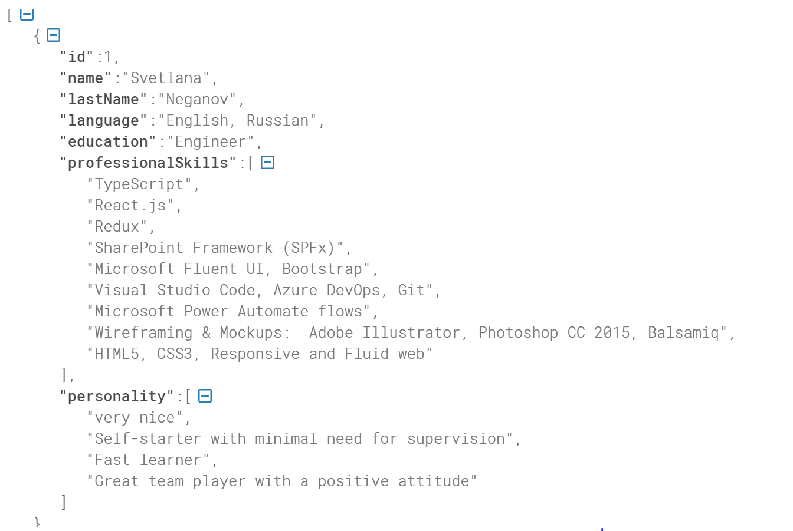

### 1.How long did you spend on the coding assignment? What would you add to your solution if you had more time? If you didn't spend much time on the coding test then use this as an opportunity to explain what you would add.

 

I spent about 4 days. First I unsuccessfully tried using public API for Zomato, then with Google Places API, where I discovered the hard way that it doesn't support CORS and so cannot be called from client-side scripts. I have decided to use https://www.tvmaze.com/ API instead.  
 If I would have more time I would:
  * add some UI features like spinner or shimmer while data is loading;
  * Fix the css UI: when there are only two TV shows listed on the screen they currently do not show up side by side; 
  * Add unit tests for filtering of TV shows list. I am running into this issue when trying to run tests using Enzyme or React Testing Library:
    Error: Could not find "store" in the context of "Connect(TVShowSearch)". Either wrap the root component in a Provider, or pass a custom React context provider to Provider and the corresponding React context consumer to Connect(TVShowSearch) in connect options.

    I am currently researching the issue further. I know that tests cannot correctly use Redux store context for some reason. My current suspicion is that it has has to do with the version of React I am using (17.0.2).
 

### 2. What was the most useful feature that was added to the latest version of your chosen language? Please include a snippet of code that shows how you've used it.

 

React hooks: useState() and useEffect().  Not latest though...
    
 

### 3. How would you track down a performance issue in production? Have you ever had to do this?

 

 By using Google Lighthouse.

4. ### How would you improve the API that you just used?
    API is fine.

 

5. ### Please describe yourself using JSON.
     
